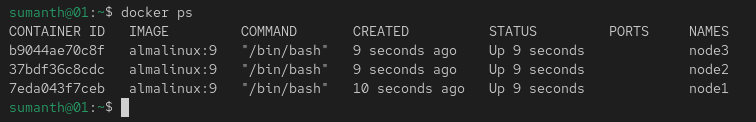
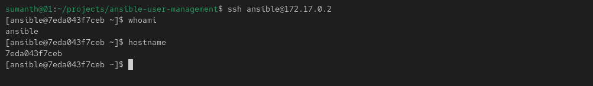
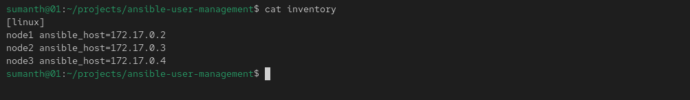
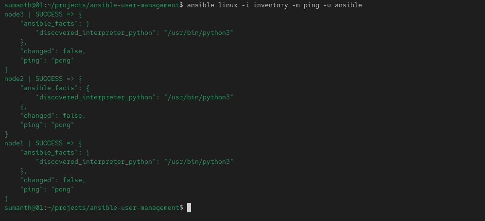
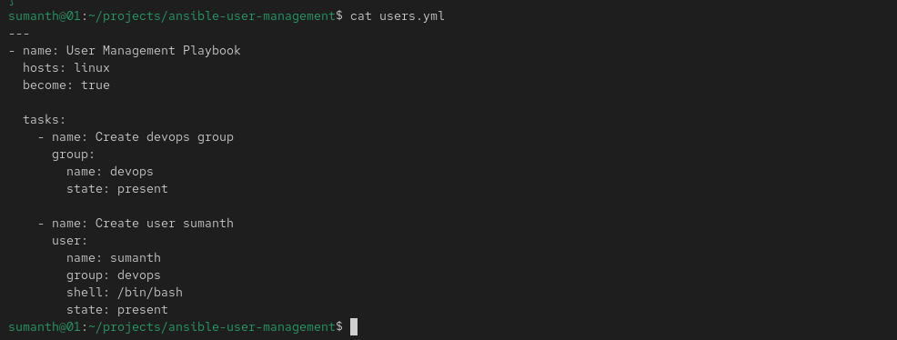
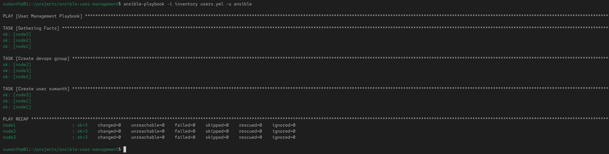
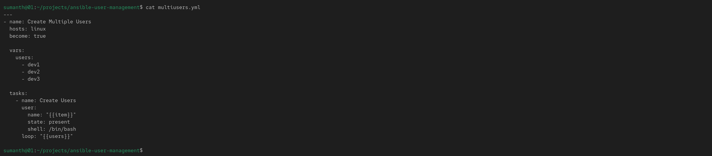
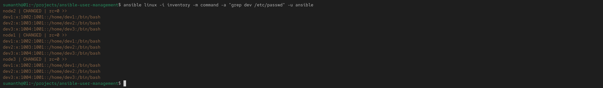
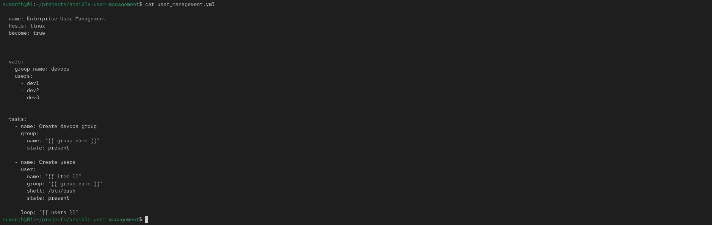

# Ansible User Management Lab using Docker Containers

## Project Overview

This project demonstrates Ansible automation using Docker-based AlmaLinux containers as managed nodes.

The objective was to learn:

- Ansible Inventory
- SSH Key Authentication
- Ad-hoc Commands
- Playbooks
- Variables
- Loops
- Idempotency
- User and Group Management

---

## Architecture

Control Node (AlmaLinux Host)

Managed Nodes:

- node1 (172.17.0.2)
- node2 (172.17.0.3)
- node3 (172.17.0.4)

All managed nodes run inside Docker containers.

---

## Environment

| Component | Version |
|------------|------------|
| OS | AlmaLinux |
| Ansible | 2.16.16 |
| Docker | 29.5.3 |
| SSH | OpenSSH |
| Managed Nodes | 3 AlmaLinux Containers |

---

## Project Workflow

### 1. Create Docker Containers

Three AlmaLinux containers were created to act as managed nodes.

---

### 2. Configure Passwordless SSH

Generated SSH keys on the control node and copied the public key to all managed nodes.

---

### 3. Configure Inventory

Created an inventory file containing all managed nodes.

---

### 4. Verify Connectivity

Validated connectivity using the Ansible ping module.

---

### 5. First Playbook

Created a playbook to:

- Create devops group
- Create Linux user

---

### 6. Idempotency Demonstration

Executed the same playbook multiple times.

Ansible reported:

- changed=0
- failed=0

demonstrating idempotent behavior.

---

### 7. Multiple User Creation

Used variables and loops to create multiple users automatically.

Users created:

- dev1
- dev2
- dev3

---

### 8. User Verification

Validated user creation on all managed nodes.

---

### 9. Final User Management Playbook

Combined concepts into a reusable user management playbook.

Features:

- Create groups
- Create users
- Assign users to groups
- Idempotent execution

---

## Key Ansible Concepts Learned

### Inventory

Maps logical host names to managed node IP addresses.

### SSH Key Authentication

Allows passwordless automation.

### Playbooks

YAML files that define automation tasks.

### Variables

Used to make playbooks reusable.

### Loops

Used to automate repetitive tasks.

### Idempotency

Running the same playbook multiple times results in the same desired state without unnecessary changes.

---

## Files Included

| File | Purpose |
|--------|---------|
| inventory | Managed node inventory |
| users.yml | Single user creation |
| multiusers.yml | Multiple user creation using loops |
| user_management.yml | Final user management automation |

---

## Future Enhancements

- Role-based user management
- Vault integration
- Dynamic inventories
- CI/CD integration
- Multi-environment deployments

---

## Author

Sumanth

Linux System Administrator | Aspiring DevOps Engineer
